## Who I am

:::: {.columns}
::: {.column width="28%"}
{width="100%"}
:::
::: {.column width="72%"}
**Niccolò Salvini, PhD** · Adjunct Professor

- **Economics**, Florence
- **MSc, Statistical and Actuarial Sciences**, Milan
- **PhD, Healthcare Data Science**, Rome
- **Founder, Intuo**: data pipelines and AI for companies
- **Adjunct Professor**: Università Cattolica, and ESE
:::
::::

## The next 55 minutes

| | | |
|---|---|---|
| **0–12** | Three ways to build a deck | PowerPoint · LaTeX Beamer · HTML |
| **12–16** | Gemini Notebook in one minute, round 1 | one source, one prompt |
| **16–30** | Tricks, while deck 1 is generating | citations, rules, the real picture |
| **30–33** | Round 2 | more sources, the UNIPG theme |
| **33–50** | Check the theme, Rivedi slide by slide, export | one slide, one instruction |
| **50–55** | Three rules to take home | |

: {tbl-colwidths="[10,50,40]"}

::: {.note-good}
One article for everyone: Van Ooijen, *Resilient Matters: The Cathedral of Syracuse as an Architectural Palimpsest*, Architectural Histories, 2019.
:::

## [Part 1]{.section-kicker} Three ways to build a deck {.section-slide background-color="#27348B"}

## Three families, one question: who decides the layout?

| | **Slides app** | **LaTeX Beamer** | **HTML** |
|---|---|---|---|
| You write in | the slide itself | `.tex` code | Markdown |
| You get | `.pptx` → PDF | PDF | a web page |
| The theme lives in | the master slide | a `.sty` file | a `.scss` file |
| Maths, references | painful | native | good (KaTeX, BibTeX) |
| Video, live charts, maps | video only | almost none | everything a browser shows |
| Good for | quick decks, templates you are given | papers, formulas, conferences in STEM | teaching, interactive material |

: {tbl-colwidths="[22,26,26,26]"}

::: {.muted .small}
Tools: PowerPoint, Keynote, Google Slides · Beamer on Overleaf · Quarto + reveal.js, Slidev, Marp.
:::

## You are looking at HTML right now

:::: {.columns}
::: {.column width="50%"}
This deck is a **Markdown file** rendered by **Quarto** into a **reveal.js** web page.

```markdown
## You are looking at HTML right now

This deck is a **Markdown file** rendered by...

- a bullet is a dash
- a picture is 
```

`quarto render deck.qmd` → `deck.html` → open in any browser, or print to PDF.
:::
::: {.column width="50%"}
::: {.box}
**The look is one file.** `unipg.scss` holds four colours read from unipg.it and one font:

[ ]{.swatch style="background:#27348B"} `#27348B` blue
[ ]{.swatch style="background:#E30613"} `#E30613` red
[ ]{.swatch style="background:#8D8F95"} `#8D8F95` grey
[ ]{.swatch style="background:#E8E8E8"} `#E8E8E8` light grey
**Roboto**
:::

Change the file, every slide changes. Keep this in mind: in Part 2 we give the same five values to Gemini.
:::
::::

## A real course deck, mapped to its technology

:::: {.columns}
::: {.column width="55%"}
[{.shot}](https://niccolosalvini.github.io/ese-ai/lectures/01-how-llms-work.html){target="_blank"}

[Click to open it live: 49 slides, Markdown + manim + SVG]{.caption}
:::
::: {.column width="45%"}
| What you see | What makes it |
|---|---|
| text, columns, tables | Markdown → Pandoc |
| slides, transitions, speaker view | reveal.js |
| animations | manim (Python) → MP4 |
| charts, diagrams | Python → SVG |
| colours, fonts | one `.scss` file |
| hosting | GitHub Pages |
:::
::::

## Inside an HTML slide you can put anything a browser shows

:::: {.columns}
::: {.column width="50%"}
```{=html}
<video width="100%" controls muted loop playsinline poster="media/w01_tokens_poster.png"><source src="media/w01_tokens.mp4" type="video/mp4"></video>
```

[A manim animation, embedded as a video]{.caption}

:::
::: {.column width="50%"}
```{=html}
<iframe src="https://www.openstreetmap.org/export/embed.html?bbox=15.2895%2C37.0575%2C15.2975%2C37.0612&amp;layer=mapnik&amp;marker=37.0593%2C15.2934" width="100%" height="300" style="border:1px solid #E8E8E8"></iframe>
```

[A live map: the Cathedral of Syracuse, today's article]{.caption}

:::
::::

::: {.small}
Also: an interactive chart, a web page, a form, a notebook, a 3D model. In a PDF none of this moves.
:::

## The LaTeX route: Beamer

:::: {.columns}
::: {.column width="55%"}
```latex
\documentclass[aspectratio=169]{beamer}
\usetheme{default}          % or the conference .sty
\definecolor{unipg}{HTML}{27348B}
\setbeamercolor{frametitle}{fg=unipg}

\begin{document}
\begin{frame}{Architectural resilience may rely
              on continuous adaptation}
  \includegraphics[height=.6\textheight]{fig3}
  \href{https://doi.org/10.5334/ah.65}{Van Ooijen 2019}
\end{frame}
\end{document}
```
:::
::: {.column width="45%"}
**Why people use it:** formulas, `\cite`, the conference asks for it, the output is one stable PDF.

**What you can embed:** TikZ and pgfplots drawings, code listings, links, step-by-step overlays (`\pause`, `\only`), frame-by-frame animation with the `animate` package.

**What you cannot really embed:** video, live maps, anything interactive.

::: {.muted .small}
Overleaf compiles it in the browser. Many conferences give you a `.sty` theme: that file is the "theme" we talk about next.
:::
:::
::::

## Every route has the same idea: the theme is one place

| Route | Where the look lives | What you change for a new conference |
|---|---|---|
| Slides app | slide master / template | open their `.potx` |
| Beamer | `.sty` or preamble | `\usetheme{conf}` |
| HTML | `.scss` | four hex codes and a font |
| **Gemini Notebook** | **the prompt** | **four hex codes and a font, written in words** |

: {tbl-colwidths="[22,34,44]"}

::: {.bigq}
An AI tool has no theme file. The prompt *is* the theme file.
:::

## [Part 2]{.section-kicker} One article, three decks, one tool {.section-slide background-color="#27348B"}

## One rule for the hour

::: {.bigq}
We work only on what is uploaded.
If the model says something and cannot show where it is in the text, for us it does not exist.
:::

## The tool in one minute

:::: {.columns}
::: {.column width="62%"}
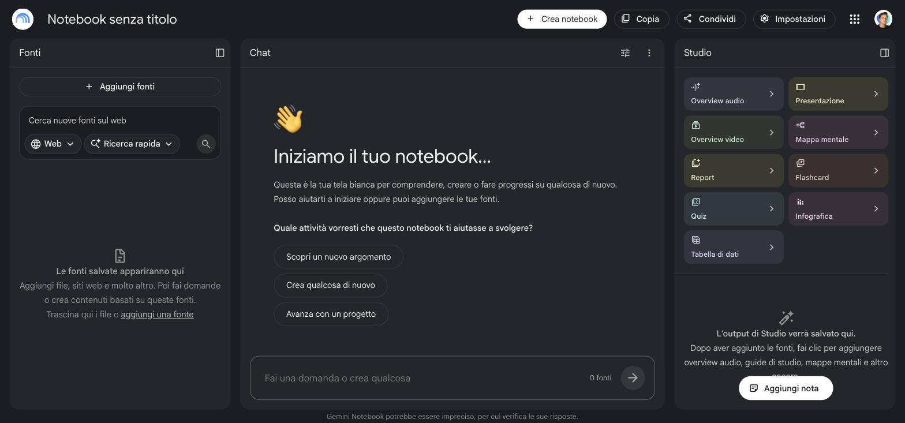{.shot}
:::
::: {.column width="38%"}
- **Sources**, left: the only thing the model reads
- **Chat**, centre: where you check, every sentence has a number
- **Studio**, right: where decks are made

notebook.google.com, with your **@unipg.it** account.
:::
::::

## The source: the PDF, checked in 30 seconds

:::: {.columns}
::: {.column width="50%"}
**Before uploading any PDF:** select a line, copy it, paste it somewhere.

| On screen | What the machine reads |
|---|---|
| Architectural Histories | `$UFKLWHFWXUDO +LVWRULHV` |
| Resilient Matters: The Cathedral… | Resilient Matters: The Cathedral… |

[That is today's article: the journal logo is unreadable, the body text is fine.]{.caption}
:::
::: {.column width="50%"}
If the text comes out garbled, the model **will still answer**, with something plausible. It never says it could not read.

**Today:** *Add source → Websites* → paste the **direct PDF link**:

[journal.eahn.org/article/7590/<br>galley/21444/download/]{style="font-family:'Roboto Mono';font-size:.8em;color:#27348B"}

::: {.muted .small}
The article page itself imports badly (menus, cookie banners). The direct PDF link imports clean.
:::
:::
::::

## Two decks, one resource at a time

:::: {.columns}
::: {.column width="50%"}
::: {.round}
[Round 1]{.round-kicker}

**Sources:** the article, nothing else

**Prompt B:** content rules. Only what is in the text, titles as claims, keep the author's caution, no generated images, last slide = limits.

→ **deck 1**
:::
:::
::: {.column width="50%"}
::: {.round .r2}
[Round 2]{.round-kicker}

**Sources:** the article **+ deck 1** (if it passed the check) **+ real photos** of the cathedral

**Prompt C:** B + keep deck 1's structure + use only the uploaded photos + the UNIPG theme.

→ **deck 2**
:::
:::
::::

::: {.small}
One change per round. The third generation of the day stays in your pocket. Deck **A**, the one-line prompt, you only see on my screen: no need to spend a generation on it.
:::

## Three decks a day

:::: {.columns}
::: {.column width="38%"}
::: {.bignum}
3
:::

[presentations per account per day, measured this morning on @unipg.it]{.bignum-caption}
:::
::: {.column width="62%"}
- The 4th attempt: *"Hai raggiunto il limite giornaliero di slide"*. It did not come back at 9:00.
- A deck takes **about 7 minutes**.
- **Rivedi does not count**: ~2 minutes for one slide, ~15 for all seven.
- Plan: **two generations**, one spare. Everything else is Rivedi.
:::
::::

## Everything you need to copy is on one page

:::: {.columns}
::: {.column width="34%"}
{width="100%"}
:::
::: {.column width="66%"}
::: {.url-line}
niccolosalvini.github.io/unipg_ai_workshop
:::

- the direct link to the article, and the two photos
- prompts **B** and **C**, with a copy button
- the five questions for the comparison, Rivedi examples
- these slides, and the decks generated this morning
:::
::::

## Round 1 · launch now: Studio → Presentation → customise

:::: {.columns}
::: {.column width="55%"}
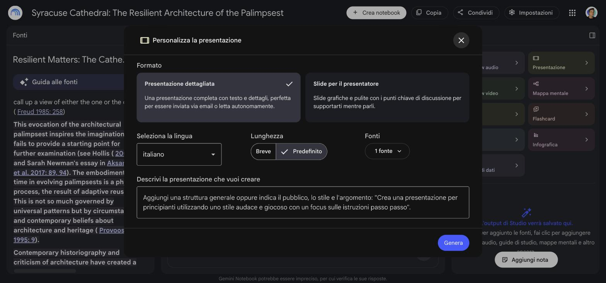{.shot}
:::
::: {.column width="45%"}
<span class="step">1</span> Format: **Presenter slides**, the right-hand card

<span class="step">2</span> Language: **English**

<span class="step">3</span> Sources: **only the article**

<span class="step">4</span> Paste prompt **B** → *Genera*

::: {.key}
The dialog forgets format and language every time. Check them before *Genera*.
:::

Then close it. **Don't watch the spinner**: 7 minutes of tricks start now.
:::
::::

## [Part 3]{.section-kicker} Tricks, while your decks are generating {.section-slide background-color="#27348B"}

## Trick 1 · The number is the only thing that lets you trust

:::: {.columns}
::: {.column width="62%"}
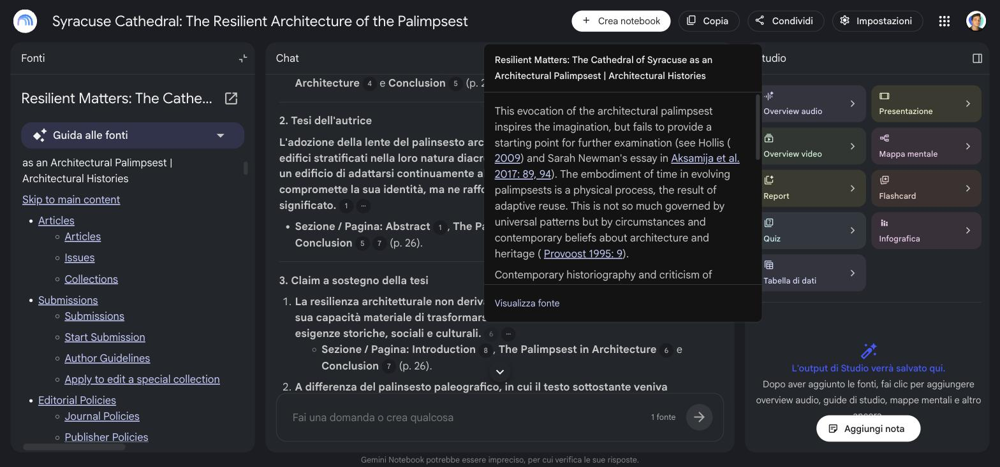{.shot}
:::
::: {.column width="38%"}
In the chat, every sentence carries a number. **Click it**: the passage of the article opens.

If the passage says less than the sentence, the sentence does not go on a slide.

::: {.muted .small}
Ask in chat: *"What are the three claims the thesis rests on? Cite the page for each."* Then click every number.
:::
:::
::::

## Trick 2 · Without rules, the tool illustrates. Here is deck A.

:::: {.columns}
::: {.column width="64%"}
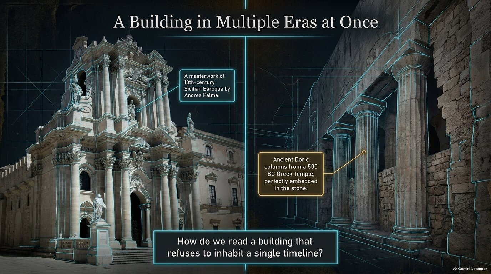{.shot}
:::
::: {.column width="36%"}
The captions are **right**: 500 BC, Andrea Palma, 18th-century Baroque are all in the article.

The **picture is not**. It is a generated cathedral: a document of a building that does not look like that.

::: {.note-bad}
In a talk, a generated photo of a real place reads as evidence.
:::
:::
::::

## Trick 3 · Rules work on content. Here is deck 1.

:::: {.columns}
::: {.column width="64%"}
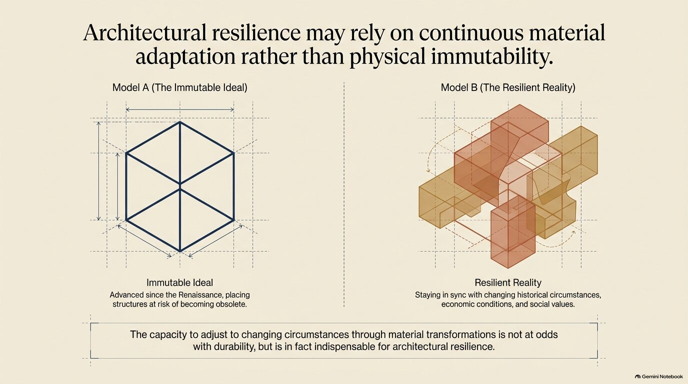{.shot}
:::
::: {.column width="36%"}
- the title is **a claim**, not a topic
- it keeps the author's caution: *"**may** rely"*
- diagrams instead of photos
- the last slide is the author's limits

::: {.note-good}
Same article, same tool, ten more lines of prompt.
:::
:::
::::

## Be honest about this: the same prompt never gives the same deck

:::: {.columns}
::: {.column width="50%"}
{.shot}
[Prompt B, @unipg.it account, 08:27]{.caption}
:::
::: {.column width="50%"}
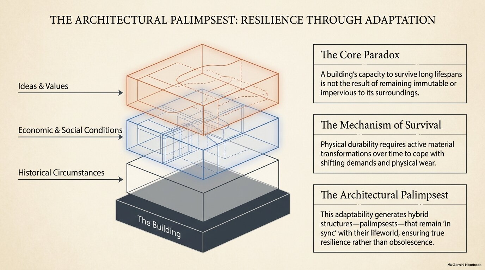{.shot}
[Prompt B, identical, another account, 08:20. The title is a topic label again.]{.caption}
:::
::::

::: {.box}
**Style you can steer. Structure you cannot reproduce.** Every generation is a new draw. That is why we compare decks and keep slides, instead of hoping the next run is the right one.
:::

## Trick · A deck that passed the check becomes a source

:::: {.columns}
::: {.column width="50%"}
1. Deck 1 ready → read every slide with the five questions
2. If it holds: **⋮ → Download → PDF**
3. **Add sources → Upload file** → the PDF
4. In prompt C: *"keep the order and the titles of the uploaded deck"*
:::
::: {.column width="50%"}
::: {.note-good}
Round 2 starts from something you already checked, instead of from a new draw.
:::

::: {.note-bad}
Once uploaded, the deck **is a source**: the model treats it as true as the article. Upload it only after you checked it, or its mistakes come back with a citation number.
:::
:::
::::

## Trick · Give it the real picture instead of letting it draw one

:::: {.columns}
::: {.column width="50%"}
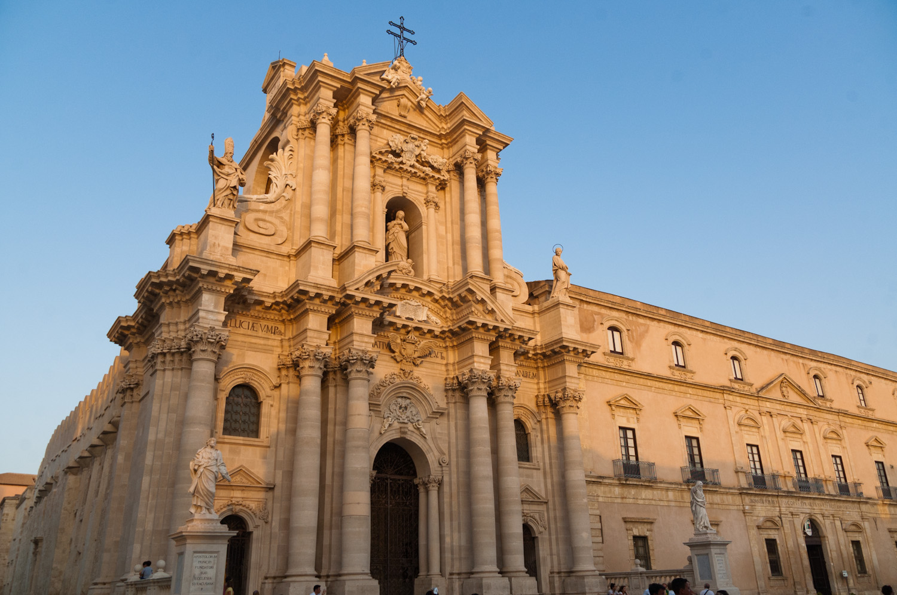{.shot}
[Façade, Guillaume, CC BY 2.0, Wikimedia Commons]{.caption}
:::
::: {.column width="50%"}
Deck A drew a cathedral. The real one is on Wikimedia Commons, with a licence.

- **Add sources → Upload file** → the photo. An image **cannot** be added by URL: the link fails.
- In prompt C: *"for the cathedral use only the uploaded photographs, credited on the slide; never generate an image of the building"*

::: {.muted .small}
Both photos, with credits, are on the materials page.
:::
:::
::::

## Round 2 · launch: more sources, prompt C

:::: {.columns}
::: {.column width="50%"}
<span class="step">1</span> **Add sources**: deck 1 PDF (if it passed), the two photos

<span class="step">2</span> Studio → Presentation → **Presenter slides**, **English**

<span class="step">3</span> Sources: **all of them**

<span class="step">4</span> Paste prompt **C** → *Genera*
:::
::: {.column width="50%"}
::: {.box}
**Prompt C** = prompt B, plus:

*keep the order and titles of the uploaded deck · for the cathedral use only the uploaded photographs, credited · UNIPG theme: `#27348B`, `#E30613`, `#8D8F95`, `#E8E8E8`, Roboto, a thin blue rule under each title*
:::
:::
::::

## Trick 4 · A theme is hex codes and a font, not adjectives

:::: {.columns}
::: {.column width="50%"}
{.shot}
[Deck 1 (prompt B)]{.caption}
:::
::: {.column width="50%"}
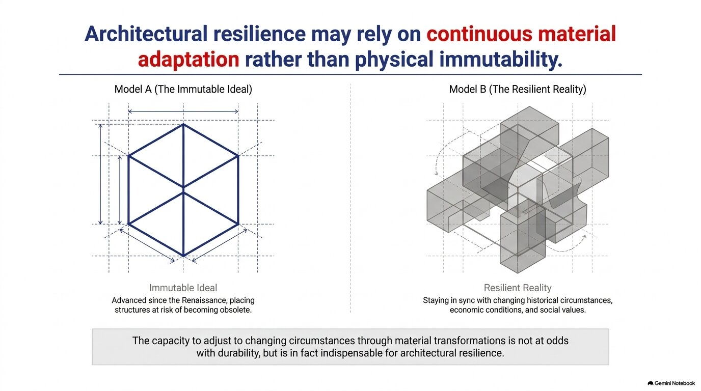{.shot}
[The same deck + the UNIPG theme: `#27348B`, `#E30613`, `#8D8F95`, `#E8E8E8`, Roboto, a blue rule. Same words.]{.caption}
:::
::::

::: {.small}
**"Elegant, institutional, blue"** gives a different blue every time. **`#27348B`, Roboto** gives the same one. Your conference's codes are in its template (`.potx`, `.sty`), its website CSS (Inspect), or its logo `.svg` (`fill="#…"`).
:::

## Check that the theme held on every slide, not only the first

:::: {.columns}
::: {.column width="60%"}
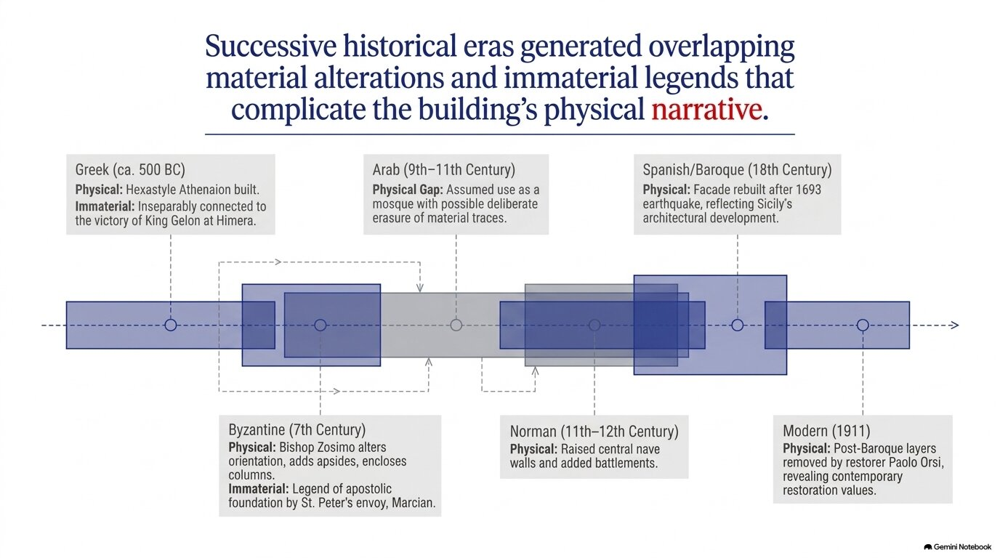{.shot}
[Slide 4 of the same deck]{.caption}
:::
::::: {.column width="40%"}
Slides 1, 2, 3, 5, 6, 7: blue sans-serif titles, one red word.

Slide 4: **serif, black title**, as before the theme. The theme did not reach it.

Also: grey boxes in the top-right corner, where we asked for *empty*.

::: {.note-good}
Fix: Rivedi on slide 4 alone, same instruction. One slide, two minutes.
:::
:::::
::::

## Trick 5 · Read the text inside the picture

:::: {.columns}
::: {.column width="64%"}
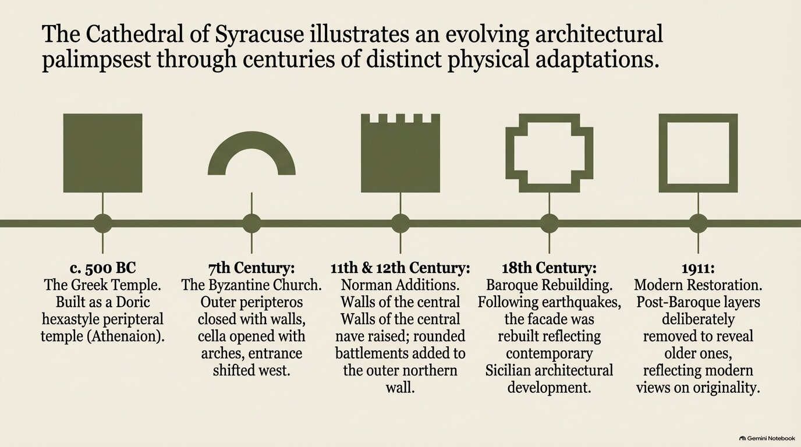{.shot}
:::
::: {.column width="36%"}
Generated slides are **images** (PNG, 1376×768), even in the **.pptx** download: seven pictures, no text boxes. The text is drawn, not typed.

Look at the third column: *"Walls of the central **Walls of the central** nave raised"*.

::: {.note-bad}
No spell-checker, no copy-paste, no search. You read every slide yourself, or nobody does.
:::
:::
::::

## Trick 6 · Rivedi: one slide, one instruction

:::: {.columns}
::: {.column width="50%"}
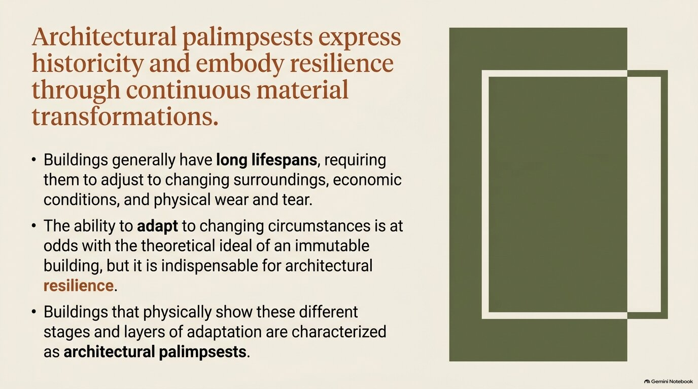{.shot}
[Before]{.caption}
:::
::: {.column width="50%"}
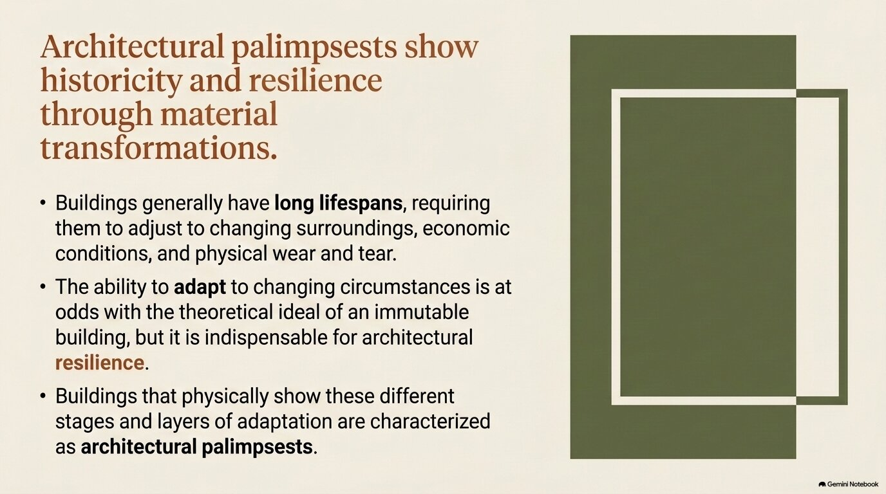{.shot}
[After: *"Shorten the title to at most 10 words, keeping its meaning. Keep layout, colours and text exactly as they are."*]{.caption}
:::
::::

::: {.small}
Open the deck → **Rivedi** → click a slide → write one instruction → *Genera presentazione rivista*. It makes a **copy** ("(2)"), the original stays. About 2 minutes, and it does not use your daily three.
:::

## Rivedi fixes form. The chat fixes content.

:::: {.columns}
::: {.column width="50%"}
::: {.note-good}
**Rivedi is good for**

- shorter title, dictated title
- remove a bullet list, split a slide
- a colour, a font, alignment
- *"keep layout and image"*
:::
:::
::: {.column width="50%"}
::: {.note-bad}
**Rivedi does not read the sources**

- it cannot check if a claim is true
- it can make a wrong claim sound better
- what is *said* is fixed in chat, with the citations open, then you regenerate
:::
:::
::::

## [Part 4]{.section-kicker} Compare, keep, export {.section-slide background-color="#27348B"}

## Put the decks side by side, and look for five things

| | Question | Where it usually shows up |
|---|---|---|
| 1 | Is there a **picture of a real place or person** the tool made up? | deck A |
| 2 | Is there a **number or date** you cannot find in the article? | deck A |
| 3 | Is a title a **topic** instead of a **claim**? | anywhere, even deck 1 |
| 4 | Does a verb go **stronger than the text**: *suggests* → *proves*? | deck A, sometimes deck 1 |
| 5 | Did the **theme** hold on every slide, or only on the first? | deck 2 |

: {tbl-colwidths="[5,70,25]"}

::: {.note-good}
Point 4 is the one that matters in research. Look at the verbs.
:::

## Keep the best slides, fix them one by one, export

:::: {.columns}
::: {.column width="50%"}
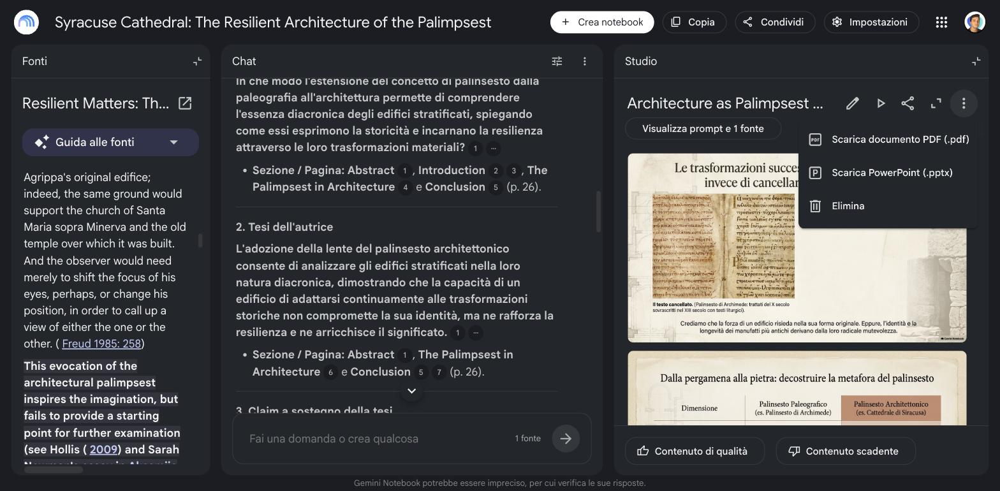{.shot}
:::
::: {.column width="50%"}
1. Keep **one deck**, usually deck 2.
2. Every slide that fails the five questions: **Rivedi**, one instruction per slide.
3. A better slide in deck 1? Say it in Rivedi (*"replace slide 4 with a timeline of…"*). The tool cannot paste across decks.
4. **⋮ → Download → PDF**, every version you like: you cannot rerun one.
:::
::::

## Then most people take it out to Google Slides

:::: {.columns}
::: {.column width="50%"}
1. **⋮ → Download → PowerPoint (.pptx)**
2. Google Drive → **Open with Google Slides**, or in your deck *File → Import slides*
3. Add your logo, your notes, your own slides around it

::: {.note-bad}
Each slide arrives as **one picture**: no text boxes. You edit around it, not inside it.
:::
:::
::: {.column width="50%"}
**The watermark.** Every slide carries a small *Gemini Notebook* badge bottom right, and the images carry **SynthID**, an invisible watermark.

- In Slides you can cover or crop the badge.
- SynthID stays in the pixels. It is how a generated image can still be recognised.

::: {.box}
Removing the badge is cosmetic. **Declaring the use is not optional**: see the last slide.
:::
:::
::::

## Three rules to take home

1. **The prompt is the theme file.** Hex codes and a font, not adjectives. Constraints, not wishes: what you do not forbid, the tool does.
2. **Rivedi fixes form, the chat fixes content.** Rivedi does not read the sources.
3. **Every deck is a draw.** Export it, read every slide, keep the good ones. Versions are free, trust is not.

::: {.muted .small}
Materials, slides and example decks: **niccolosalvini.github.io/unipg_ai_workshop**. When you use it for real: declare it. *"Slides drafted with Gemini Notebook from the author's article, checked and edited by the author."* Generated images carry a visible and an invisible watermark.
:::
